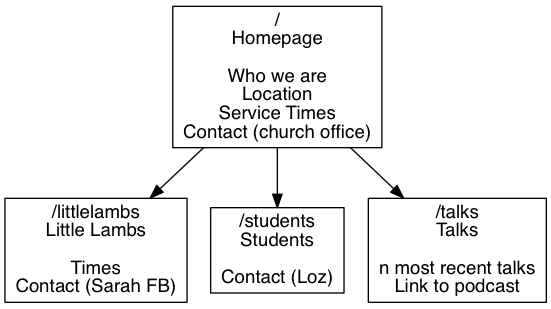

# Christ Church Mayfair - Website

This repository contains information pertinent to the rebuild of the CCM website.

## Personas

A collection of the core personas we aim to cater for - they are divided into newcomers and regulars, and since the larger proportion of traffic to the CCM site are (as far as we can tell from the data) newcomers, these are the dominant category.

See [Personas](https://www.usability.gov/how-to-and-tools/methods/personas.html)

### Prospective Newcomers

These people have not yet been through the door at CCM. We'd really love them to.

#### Student

They are new to London and are looking for a church. Perhaps they just googled us or they met our wonderful student worker at their freshers fair or one of their CU friends comes to CCM and has recommended us.

Variations: Maybe at one of the prestigious universities or something a bit more normal. Could be a STEM student or in the arts. Maybe a first year undergrad or doing a PhD.

#### Western Expat

Moved to London from the US or Australia. Only here for a couple of years. Here with my spouse. Relatively well taught at my home church - may have been recommended to look at CCM by a friend who came here 5 years ago.

Variations: May have children. May be recently married.

#### Asian Student

Here in London to work or improve their English. May have been to International Café. Either from a wealthy family who could afford to send them or they're working crazy hours in a Pret in the west end just to pay the rent.

####Young Christian

They are new to London, having moved here for work after graduating. They've grown up in a Christian home but are not perhaps not very discerning. They are not UK Con Ev mafia. They don't have an opinion on esoteric theological matters and have little clue about who's a good Bible teacher and what that means.

####"Discerning" Christian

They are new to London, having recently graduated. They went to a great summer camp and thanks to that they know they're looking for a church who take Bible teaching seriously. They may even have been recommended CCM by the person who lead the helpers at their posh sounding summer camp.

#### Nanny

She was not born in the UK and had been working as a nanny for a rich family who live in Mayfair. She's followed them round the world for the past couple of years. She has little to no idea about Christianity or perhaps thinks she's a Christian but might struggle to explain her faith. She's keen to meet new people people and will usually have the children in tow. Keeping them entertained is a mission!

### Regulars

These people come to CCM. They range from the ultra-commited to the more fringy folk.

TODO: Needs to be developed.

### Staff/Volunteers

No need for personas here as a) the population of users is small and b) we know them!

## User Stories/Needs

User stories describe a need that a persona (or many personas) has.

See [User Stories](https://www.gov.uk/service-manual/agile-delivery/writing-user-stories)

### Potential Newcomer - Common Stories

These stories are common to many of the potential newcomer personas.

As a **potential newcomer** I want to **know where CCM is located** So that I can **work out how I might get there**.

As a **potential newcomer** I want to see what kind of people go to CCM so that I can work out if I might fit in/not stand out there.

As a **potential newcomer** I want to see when you meet so that I can plan to come.

As a **potential newcomer** I want a means to contact CCM so that if there's an un-answered question that I have there's a way I can have it answered.

### Specific Stories

As a discerning newcomer I want to see that CCM is a sound Bible teaching church so that I can be assured that it's worth a visit.

## Site Plan

This is a draft site plan. To be improved.

